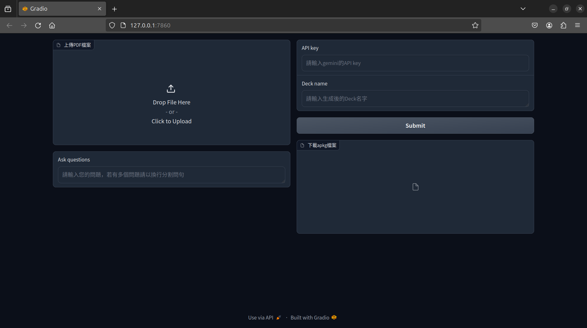

# PDF2Anki

Upload a PDF file, use Gemini to extract questions from it and create an .apkg file, then download it for self-testing on how familiar you are with the content of the document.

## Prerequisites
- Python 3.10 or higher
- Obtain a Gemini API from [Google AI Studio](https://ai.google.dev/gemini-api/docs/workspace)

## Installation

You can use either pip or conda to load the required packages from the `requirements.txt` file.

For pip
```bash
pip install -r pip_requirements.txt
```

For conda
```bash
conda install --yes --file conda_requirements.txt
```

## Usage

Here is the revised version of your instructions for improved grammar and flow:

1. Run the script `python AnkiProducer.py`.
2. Hold down Ctrl and click on the Local URL.
3. You will see the following screen. Upload the PDF and ask some questions (it is okay to leave the question textbox blank).
   
4. Enter the Gemini API key and the name of the deck in the textboxes on the right side, then wait for the questions to be generated.
5. Once the execution is completed, you can download the `.apkg` file and upload it to your Anki.

## Notes

- Intending to incorporate additional question-generation modes.
- Adding (aiming to achieve) image interpretation.
