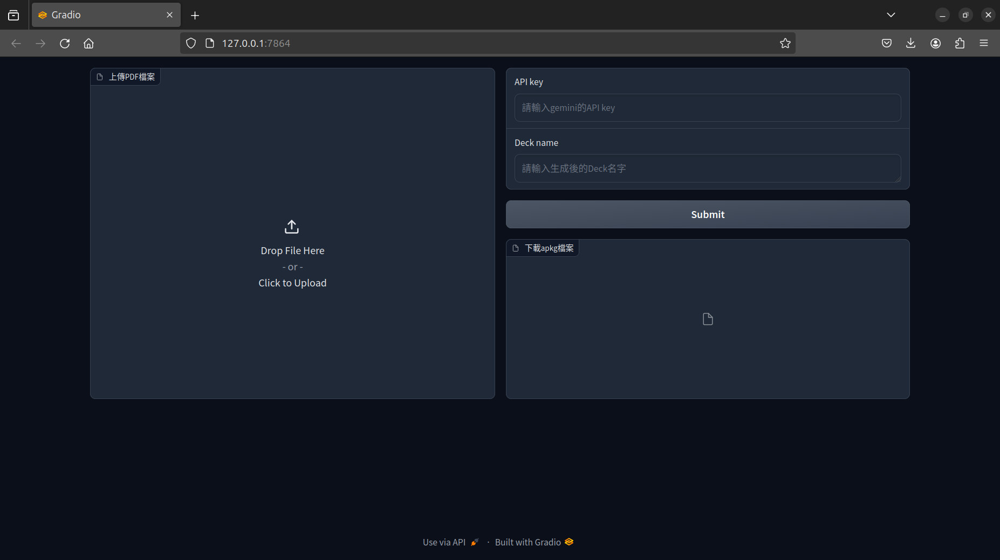

# PDF2Anki

Upload a PDF file, use Gemini to extract questions from it and create an .apkg file, then download it for self-testing on how familiar you are with the content of the document.

## Prerequisites
- Python 3.10 or higher
- Obtain a Gemini API from [Google AI Studio](https://ai.google.dev/gemini-api/docs/workspace)

## Installation

You can use either pip or conda to load the required packages from the `requirements.txt` file.

For pip
```bash
pip install -r requirements.txt
```

For conda
```bash
conda install --yes --file requirements.txt
```

## Usage

1. Run the script  `python AnkiProducer.py` 
2. Hold down Ctrl and click on the Local URL.
3. You will see the following screen, upload the PDF, enter the Gemini API key and the name of the deck, then wait for the questions to be generated.

4. After the execution is completed, you can download the `.apkg` file and upload it to your own Anki.

## Warning

Due to token restrictions with gemini-pro, to avoid exceeding the usage limit per minute, the generation speed is adjusted using the `time` module, resulting in longer waiting times.

## Notes

- Intending to add a user question-generation mechanism.
- Intending to incorporate additional question-generation modes.
- Adding (aiming to achieve) image interpretation.
